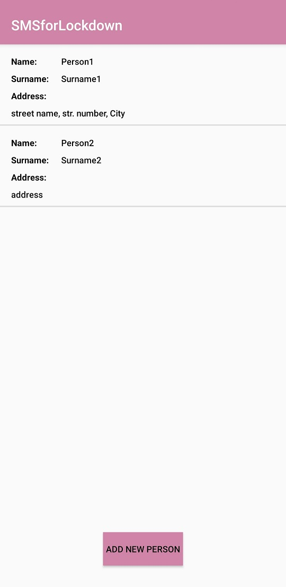
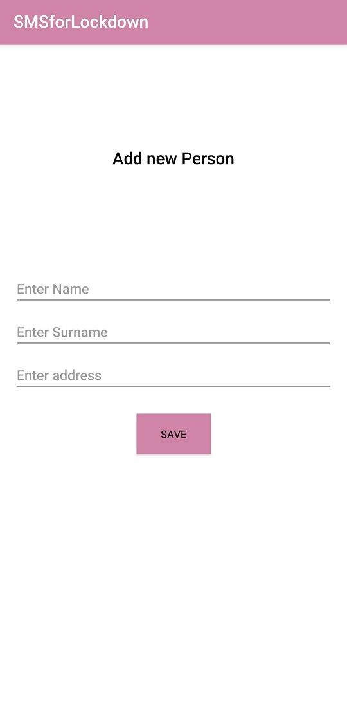

# SMSforLockdown

<b>Android SMS App for lockdownDuring the Covid-19 

Lockdown in many countries around the world, citizens are required to send an SMS for their movements.
So people will be required to send an SMS text message to a specific number in order 
to obtain permission to leave their homes during the lockdown.
This android  application allows you to handle these messages in a user friendly way.

Tools used for building this application:
<ul>
<li>Android studio</li>
<li>Firebase Firestore(for storing data)</li>
</ul>

<b>Select one of the users or ad new one

  
  
  
  
  <b>SMS will be sent based on the button klicked 
  
  
